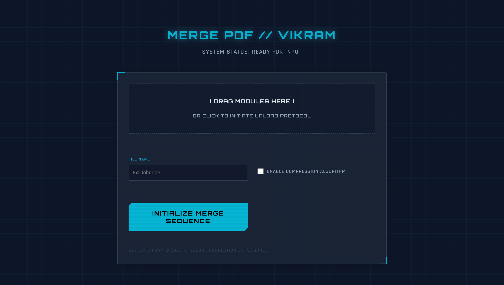

# SYSTEM_VIKRAM // PDF MERGE MODULE

> **"Advanced Document Compilation System."**

**Merge PDF // SYSTEM_VIKRAM** is a client-side, zero-latency tool designed for the secure compilation of corporate and legal documents. It features a "Deep Cyber-Navy" HUD interface, offering military-grade privacy by processing all data locally on the user's machine.

---

## 🖥️ Visual Interface

---

## ⚡ System Capabilities

* **Zero-Knowledge Architecture:** No file is ever uploaded to a server. 100% of the processing happens in your browser's memory.
* **Drag-and-Drop Module:** Intuitive drop zone with visual feedback for quick file ingestion.
* **compression_algo:** Optional built-in compression to reduce file size for email attachment compliance.
* **Metadata Injection:** Automatically renames the output file based on standardized inputs (User Identity, Geo-Location, Cycle Dates).
* **Sequence Control:** Reorder document stack with precision Up/Down controls before merging.

---

## 🛠️ Tech Stack

* **Core:** HTML5, CSS3 (CSS Variables, Backdrop Filters).
* **Engine:** `pdf-lib` (High-performance PDF manipulation library).
* **Design Language:** Cyber-Navy Palette (`#0f172a`, `#06b6d4`, `#d946ef`) with Orbitron & Rajdhani typography.
* **Deployment:** GitHub Pages (Static Hosting).

---

## 🚀 Deployment Protocols

This system is designed for instant deployment via GitHub Pages.

1.  **Clone Source:** Fork this repository.
2.  **Initiate Hosting:** Go to `Settings` -> `Pages` -> Select `main` branch.
3.  **System Live:** Access your tool at `https://thevikramsinha.github.io/merge-pdf/`

---

## 📄 Usage Instructions

1.  **Initialize:** Launch the system URL.
2.  **Ingest:** Drag PDF documents into the "Drop Module" or click to browse.
3.  **Configure:**
    * **Identity:** Enter User Name (e.g., `Officer_Doe`).
    * **Geo-Location:** Enter Sector/Location (e.g., `NY_HQ`).
    * **Cycle Dates:** (Optional) Select Start/End dates.
4.  **Sequence:** Use `▲` / `▼` buttons to align the document stack.
5.  **Execute:** Toggle `ENABLE COMPRESSION` if required, then click **INITIALIZE MERGE SEQUENCE**.

---

## 🔒 License & Security

**License:** MIT Open Source.
**Security Notice:** This tool functions entirely offline after loading. No data leaves your network perimeter.

---

**System Architect:** [Vikram Kumar Sinha](https://thevikramsinha.github.io/)
**Version:** 2.0 (Cyber-Upgrade)
